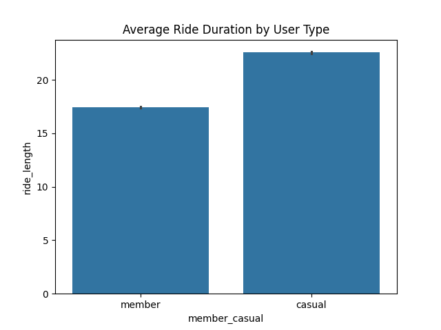

# Cyclistic Bike-Share Data Analysis

## Project Overview

This project analyzes over **5.9 million bike-share records** to understand how casual riders and annual members use Cyclistic bikes differently.

The goal is to generate insights that can help convert casual riders into annual members.

---

##  Business Problem

Cyclistic wants to increase the number of annual memberships.  
To achieve this, we analyze behavioral differences between:

- Casual Riders
- Annual Members

---

## Tools & Technologies

- Python (Pandas, Matplotlib, Seaborn)

---

## Data Cleaning & Preparation

- Converted datetime columns using `pd.to_datetime()`
- Handled invalid values using `errors='coerce'`
- Removed missing records using `dropna()`
- Created new feature: **ride_length (in minutes)**
- Filtered out unrealistic ride durations (< 0 and > 24 hours)
- Extracted **day of week** and **month** for analysis

---

##  Key Insights

-  Members take significantly more rides than casual riders
-  Casual riders have longer average ride durations
-  Members ride mostly on weekdays (commuting behavior)
-  Casual riders prefer weekends (leisure usage)
-  Casual ridership peaks during summer months

---

##  Visualizations

### 1. Total Rides by User Type

### 2. Rides by Day of Week

### 3.  Rides by Month

---

## Business Recommendations

1. **Convert Casual Riders to Members**
   - Offer discounts and trial memberships

2. **Seasonal Marketing Campaigns**
   - Target users during peak summer months

3. **Commuter-Focused Benefits**
   - Provide incentives for weekday riders

---

## Project Structure
